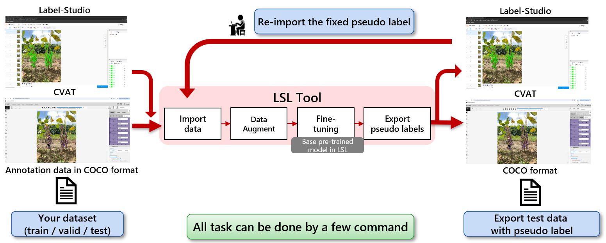
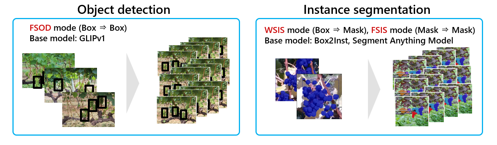
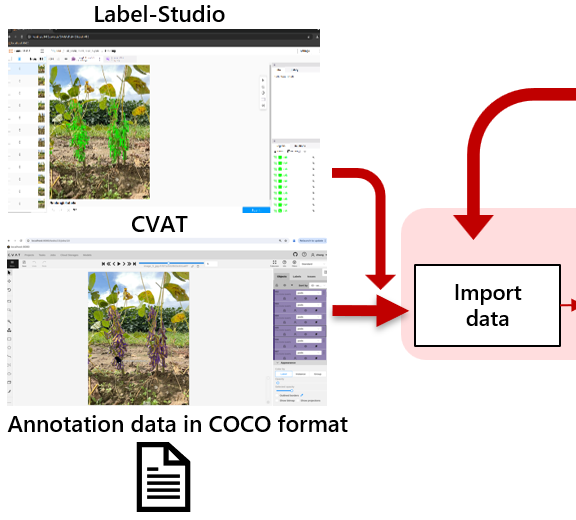
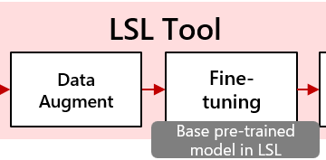
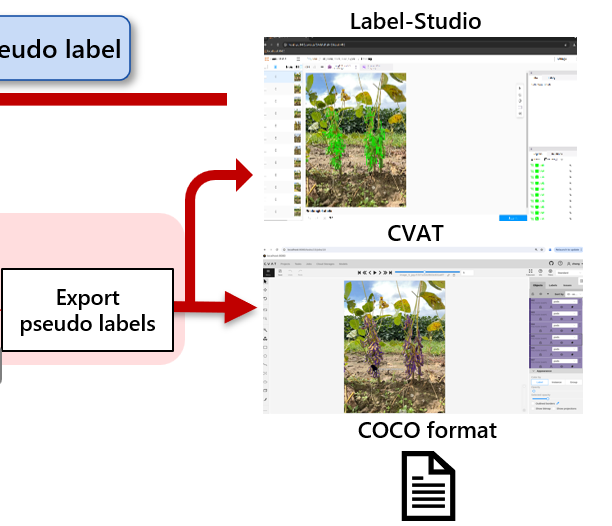
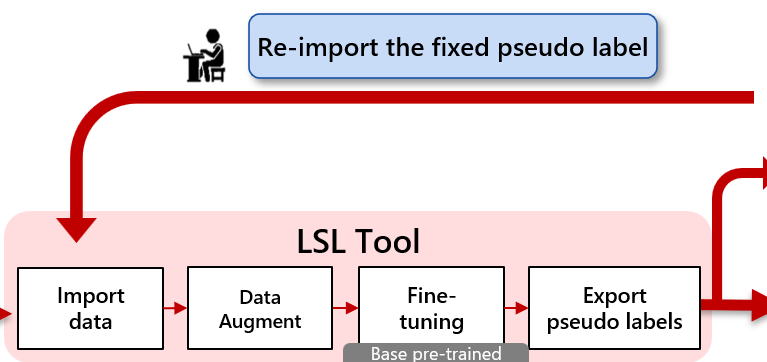
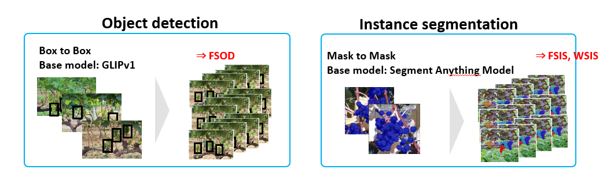

# Labor-Saving-Labeling (LSL) tool

## Introduction

The LSL tool is designed to automatically annotate images for object detection task and instance segmentation task. 
It can generate a large amount of high-quality pseudo labels with a small amount of data or lower level data which are easier to be labeled.

Even if you have high demands for label quality, combined with other labeling tools, e.g. Label Studio and CVAT, it can help you save a significant amount of labeling time.

## Overview of LSL


 
Using LSL tool, you can import your dataset to LSL tool, data augment, fine-tuning and infer test data WITH ONLY A FEW COMMAND.
You don't need environment setting, pre-trained model selection, coding or somethins like that. Here is the basic usage of LSL tool step by step.

## Installation
You need to install LSL tool to your own PC and LSL tool use your PC's calculation resourece especially when fine-tuning.
Please refer to [**Installation**](documents/README_installation.md) for installation instructions.

## Mode select
LSL tool has three modes, **Few-Shot Object Detection (FSOD)**, **Weakly Supervised Instance Segmentation (WSIS)**, **Few-Shot Instance Segmentation (FSIS)**.
Here is the description of each mode. You can select by your label format and install each pre-trained using our scripts.



| LSL Tools Mode   | Dataset type   | Auto-labeling type  | Model           | Dataset for pre-train           | Remark                                                                                    | 
| ---------------- | -------------- |-------------------- | ----------------|---------------------------------|------------------------------------------------------------------------------------------ |
| FSOD             | Bounding box   | Bounding box        | GLIP_tiny       | O365, GoldG,CC3M, SBU           | Few-shot object detection, training with few images with bounding boxes labels            |
| WSIS             | Bounding box   | Mask                | Box2inst, SAM-B | SA-1B                           | Weakly supervised instance segmentation, training with images with bounding boxes labels. |
| FSIS             | Mask           | Mask                | SAM-B           | SA-1B                           | Few-shot instance segmentation, training with images with mask                            |

## Data import





LSL tool assume that you have the raw image dataset and some of them are already annotated.
Then you can import such a dataset to LSL tool by following commands.

```
    # Import train or validation data (COCO format)
    lsl import  --image ${train_data_dir} \
                --annotation ${train_ann_path} \
                --name ${train_data_source_name}

    # Import test data (auto-labeling target)
    lsl import  --unlabeled ${test_image_dir} \
                --name ${test_data_source_name}
```
The above command can be used when you have the annotation data as json file.
Besides, if you are using CVAT or label-studio, the famous annotation tools, LSL tool can collaborate with them. You can import the dataset to LSL tool from their project using the following commands.

```
    # Import train & validation data from Label Studio project 
    lsl import --labelstudio-project-id <labelstudio/project/id> \
               --name <data_source_name>
    # labelstudio-project-id can be obtained from labelstudio url

    # Import train & validation data from from CVAT project 
    lsl import --cvat-task-id ${cvat_task_id} --name {test_data_source_name}
```
Here is the official web site of the two tools.
[Label Studio](https://labelstud.io/), [CVAT](https://www.cvat.ai/)

## Fine-tuning



After data get imported LSL can start the auto-labelling​ to add pseudo labels to unlabeled data.
```
    # Start auto-labelling
    # Adaptive number of iteration will be used if `--iter` not specified    
        lsl auto-label  --train ${train_data_source_name} \
                        --valid ${validation_data_source_name} \
                        --test ${test_data_source_name} \
                        [--iter ${number_of_training_iterations}] \
                        [--fs-base-model ${path_to_user_pretrained_weight}] \
                        [--fs-resume <resume training or not>] \
                        [--conf ${confidence_score}] \
                        [--slidewindow <do not set it if you don't want to use slidewindow>]\
                        [--slidewindow-size ${slidewindow_width, default 1024} ${slidewindow_height, default 1024}] \
                        [--overlap ${overlap, default 150}] \
                        [--object-threshold ${iou threshold for imcomplete bboxes or masks after slidewindow, default 0.2}]
```
After this command, data augmentation and fine-tuning automatically starts. You can know the meaning of each argument is described in `Documents` .

## Visuallizaion of pseudo labels and fix them by CVAT, label-studio



It is natural that you want to see the pseudo label with test data and sometimes, the pseudo-labels generated by LSL tools are not perfect enough. 
In this cases, we can export the pseudo label to two famous labeling tools, Label-studio and CVAT. Then you can check and fix (if necessary) pseudo-labels by them and re-import and re-fine-tune.
The commands are here.

```
    # Export LSL auto-labeling result to Label Studio
    lsl labelstudio-export  --train ${train_data_source_name} \
                --name ${test_data_source_name} \
                --labelstudio-name ${labelstudio_project_name}

    # Export LSL auto-labeling result to CVAT
    lsl cvat-export  --train ${train_data_source_name} \
                --name ${test_data_source_name} \
                --cvat-name ${cvat_task_name}
```

## Human in the loop



By using LSL tool function as explained so far, we can iterate fine-tunig -> fix manually -> data re-import to LSL tool -> fine-tuning...
It is important to interate rapidly and effectively to create the high quality dataset.
LSL tool would be helpful to do it.

## Documents
The above explanation is general one to show the overview and concept of LSL tool.
You can see the below documents to understand it in detail.

First, Here is the instructions that will walk you how to generate pseudo labels for differnet tasks by LSL Tools.
After the installation, you can start the bellow docs.

- [**Few-Shot Object Detection (FSOD)**](documents/README_FSOD.md)
- [**Weakly Supervised Instance Segmentation (WSIS)**](documents/README_WSIS.md) 
- [**Few-Shot Instance Segmentation (FSIS)**](documents/README_FSIS.md)

Second, Here are the docs for how to collaborate LSL tool and CVAT / label-studio.
Please refer to [**Label Studio**](documents/README_labelstudio.md) and [**CVAT**](documents/README_cvat.md) to use lsl-tools with these labeling tools.

And also, LSL_tools supports integration with both LabelStudio and CVAT annotation tools. Currently, the CVAT version for Windows is not supported.
| Labeling Tools      | Ubuntu          | Windows        | 
| ------------------- | --------------- |--------------- | 
| label-studio        | Support         | Support        |
| CVAT                | Support         | Not support    |

## Environment Requirements
    LSL tools supports both Windows10 and Ubuntu 22.04 operating system. To use LSL tool a conventional desktop GPU with least 8G memory is required.
    
    Confirmed (supported) GPUs:
        GeForce 10 series
        GeForce RTX 20 series
        GeForce RTX 30 series
        GeForce RTX 40 series
        V100 Tensor Core
        A100 Tensor Core

## Installation

Please refer to [**Installation**](documents/README_installation.md) for installation instructions.

## How to use

LSL tool has three modes, Few-Shot Object Detection (FSOD), Weakly Supervised Instance Segmentation (WSIS), Few-Shot Instance Segmentation (FSIS).
You can select by your label format.



| LSL Tools Mode   | Dataset type   | Auto-labeling type  | Remark                                                                                         |
| ---------------- | -------------- |-------------------- | ---------------------------------------------------------------------------------------------- |
| FSOD             | Bounding box   | Bounding box        | Few-shot object detection, training with few images with bounding boxes labels                                                                                         |
| WSIS             | Bounding box   | Mask                | Weakly supervised instance segmentation, training with images with bounding boxes labels. We have two type of base model, box2inst and Segment Anything Model                    |
| FSIS             | Mask           | Mask                | Few-shot instance segmentation, training with images with mask                                                                                           |

Here is the instructions that will walk you how to generate pseudo labels for differnet tasks by LSL Tools and use it with third-party labeling tools to improve labeling efficiency.

- [**FSOD**](documents/README_FSOD.md)
- [**WSIS**](documents/README_WSIS.md) 
- [**FSIS**](documents/README_FSIS.md)

### Labeling Tools

Here are the two labeling tools supported by LSL Tools.

| Labeling Tools      | Ubuntu          | Window         | 
| ------------------- | --------------- |--------------- | 
| [Label Studio](https://labelstud.io/)        | Support         | Support        |
| [CVAT](https://www.cvat.ai/)                | Support         | Not support    |

LSL_tools supports integration with both LabelStudio and CVAT annotation tools. Currently, the CVAT version for Windows is not supported.

Please refer to [Label Studio](documents/README_labelstudio.md) and [CVAT](documents/README_cvat.md) to use lsl-tools with these labeling tools.

## Pretrained models

| Model               | Dataset               | Task        | 
| ------------------- | --------------------- |------------ | 
| GLIP_tiny           | O365, GoldG,CC3M, SBU | FSOD, SAM   | 
| Bert-unbase         | BookCorpus            | FSOD, SAM   | 
| SAM-B               | SA-1B                 | SAM         | 

