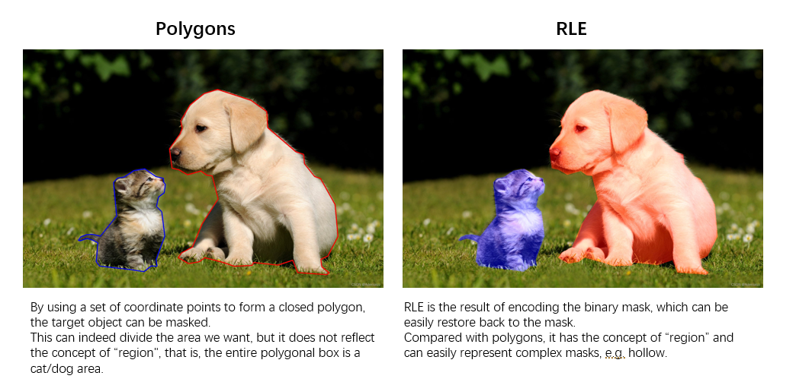
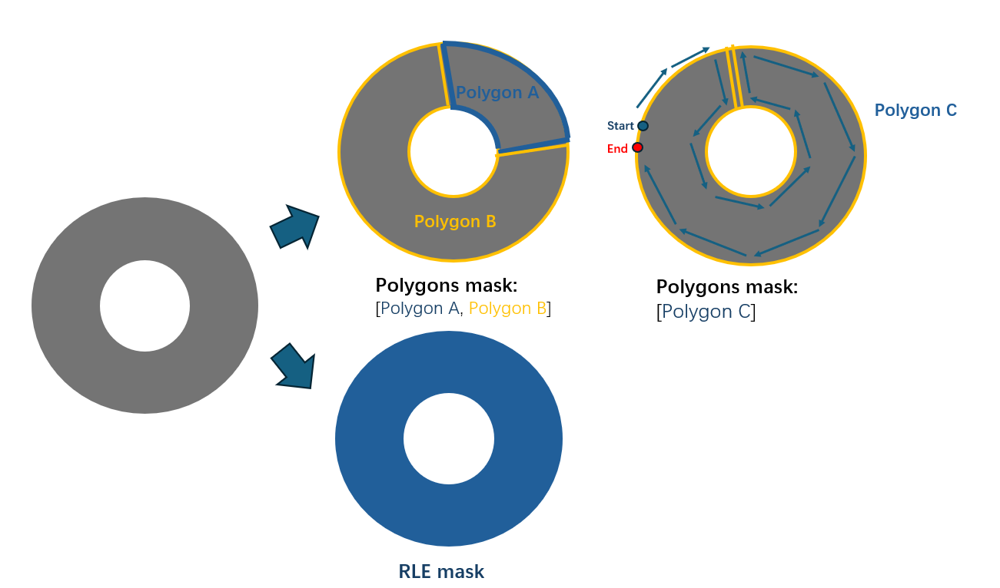

# LSL Tools FSIS task

## Overview
In LSL instance segmentation FSIS mode, users need to prepare a few images with both bounding boxes and segmentation annotations (COCO format) in advance. Then these data will be used to perform auto-labelling. Optionally user can provide validation data to measure the quality of pseudo label generated by auto-labeling. On a RTX2080 GPU, SAM based auto-labeling takes about 3 hours when working on a project with 30 training images and 1,500 training iterations.
The usage of FSIS mode is written as follows. 

## Download Pretrained Model
```
cd ${PATH_TO_LSL_Tools}
python download_pretrained_models.py --task fsis
# The pretrained models will be downloaded in ${PATH_TO_LSL_Tools}/lsl_tools/pretrain_weight
```

## Start

### Create a FSIS task
```
    # Create a LSL project
    mkdir ${PATH_TO_PROJECT}
    cd ${PATH_TO_PROJECT}
    lsl create --task fsis       # Use SAM with box prompts generated by FSOD
    lsl create --task fsis_segonly  # Use SAM with a huge box occuping the entire image, and each image only has one mask  

```

### Import dataset
The data import of FSIS task are basically the same as FSOD task.
```
    # Import train data (COCO format)
    lsl import  --image ${train_data_dir} \
                --annotation ${train_ann_path} \
                --name ${train_data_source_name}

    # Optionally import validation data (COCO format)
    lsl import  --image ${validation_image_dir} \
                --annotation ${validation_ann_path} \
                --name ${validation_data_source_name}    

    # Import target data (auto-labeling target)
    lsl import  --unlabeled ${test_image_dir} \
                --name ${test_data_source_name}

```

### Train
```
    # Start auto-labelling
    # Adaptive number of iteration will be used if `--iter` not specified    
    lsl auto-label  --train ${train_data_source_name} \
                    --valid ${validation_data_source_name} \
                    --test ${test_data_source_name} \
                    [--iter ${number_of_training_iterations}] \
                    [--conf ${confidence_score}]
                    [--slidewindow <do not set it if you don't want to use slidewindow>]\
                    [--slidewindow-size ${slidewindow_width, default 1024} ${slidewindow_height, default 1024}]
                    [--overlap ${overlap, default 150}]
                    [--object-threshold ${iou threshold for imcomplete bboxes or masks after slidewindow, default 0.2}]
```
The training iteration is specified by `--iter` argument. If not provided, an adaptive number of will be used. If iteration is set to less than one epoch, the training may still continue until a full epoch is completed.  

The best model after fintuned will be saved under `${PATH_TO_PROJECT}/.lsl/${train_data_source_name}/sam/Model/checkpoint_best.pth`.
Retraining the LSL model in the same project will trigger a prompt to confirm whether to overwrite the original best model. The prompt will appear for each model used.
If 'N' is selected, the training of this model will be skipped. 

The pseudo labels of target data will be saved under `${PATH_TO_PROJECT}/.lsl/${train_data_source_name}/inference/${test_data_source_name}/pseudo_mask_label.json`.


### Visualation
After auto-labelling, user can preview detection result on test data source.

```
    # Preview detection result on test data source
    # Currently preview of FSOD-GLIP isn't supported
    # task-fsod currently does not support preview
    lsl preview --train ${train_data_source_name} \
                --name ${test_data_source_name} \
                [--conf ${confidence_score}]

```
The confidence_score argument can be used to filter out low scored detections.


## Improvement

### Mask Format

LSL not only supports COCO’s polygon mask, but also supports COCO's RLE mask, which can support specially shaped labels.


The following picture shows a hollow scene and how to label such masks with both Polygons and RLE format. lt is easier to handle these samples for RLE than Polygons.



For these challenging mask samples, it is recommended to use CVAT for annotation, as it supports both polygons and RLE formats, and allows grouping multiple polygons together.
In comparison, Label Studio only supports a single polygon for each mask label and does not support RLE.

### SAM Only Task

For especially dense and overlap samples, the combination of SAM + prompt box is not very suitable. Therefore, we have introduced a new mode, SAM Only, which does not require the box generation model (GLIP), allowing SAM to perform functions similar to semantic segmentation with few datasets. 

