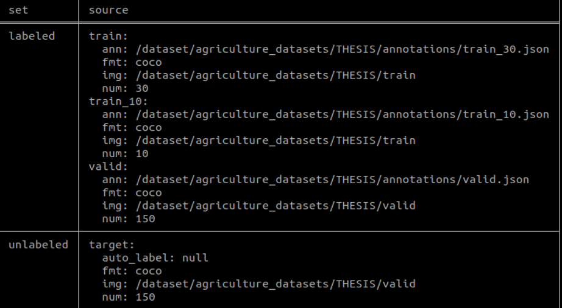

# LSL Tools FSOD task

## Overview
In LSL FSOD mode, users need to prepare a few images with bounding boxes annotations (COCO format) in advance. Then these data will be used to perform auto-labelling. Optionally user can provide validation data to measure the quality of pseudo label generated by auto-labeling. It usually only requires a few dozen images as the training dataset. If you want to improve the model's performance, you can try to increase the image size.
Currently two methods can be selected in FS mode, GLIP based and DeFRCN based method. Usually GLIP based method can provide higher AP accuracy.
The usage of FSOD mode is written as follows. 

## Download Pretrained Model
```
cd ${PATH_TO_LSL_Tools}
python download_pretrained_models.py --task fsod
# The pretrained models will be downloaded in ${PATH_TO_LSL_Tools}/lsl_tools/pretrain_weight
```

## Start

### Create a FSOD task
```
    # Create a LSL project
    mkdir ${PATH_TO_PROJECT}
    cd ${PATH_TO_PROJECT}
    
    lsl create --task fsod           # Use GLIP based method
    lsl create --task fsod-defrcn    # Use DeFRCN based method

    lsl ls                           # list data sources (it is empty at this step)
```


### Import dataset
```
    # Import train data (COCO format)
    lsl import  --image ${train_data_dir} \
                --annotation ${train_ann_path} \
                --name ${train_data_source_name}

    # Optionally import validation data (COCO format)
    lsl import  --image ${validation_image_dir} \
                --annotation ${validation_ann_path} \
                --name ${validation_data_source_name}    

    # Import target data (auto-labeling target)
    lsl import  --unlabeled ${test_image_dir} \
                --name ${test_data_source_name}


```
Run `lsl ls` command. If the data list is shown like the following image, the datasets has been imported successfully."



### Train
After data get imported LSL can start the auto-labelling​ to add pseudo labels to unlabeled data.
```
    # Start auto-labelling
    # Adaptive number of iteration will be used if `--iter` not specified    
        lsl auto-label  --train ${train_data_source_name} \
                        --valid ${validation_data_source_name} \
                        --test ${test_data_source_name} \
                        [--iter ${number_of_training_iterations}] \
                        [--fs-base-model ${path_to_user_pretrained_weight}] \
                        [--fs-resume <resume training or not>] \
                        [--conf ${confidence_score}] \
                        [--slidewindow <do not set it if you don't want to use slidewindow>]\
                        [--slidewindow-size ${slidewindow_width, default 1024} ${slidewindow_height, default 1024}] \
                        [--overlap ${overlap, default 150}] \
                        [--object-threshold ${iou threshold for imcomplete bboxes or masks after slidewindow, default 0.2}]
```
The training iteration is specified by `--iter` argument. If not provided, an adaptive number of will be used. If iteration is set to less than one epoch, the training may still continue until a full epoch is completed.  

The best model after fintuned will be saved under `${PATH_TO_PROJECT}/.lsl/${train_data_source_name}/model_best.pth`.
Retraining the LSL model in the same project will trigger a prompt to confirm whether to overwrite the original best model. The prompt will appear for each model used.
If 'N' is selected, the training of this model will be skipped. 

The pseudo labels of target data will be saved under `${PATH_TO_PROJECT}/.lsl/${train_data_source_name}/inference/${test_data_source_name}/pseudo_label.json`.

### Visualation
After auto-labelling, user can preview detection result on test data source.

```
    # Preview detection result on test data source
    # Currently preview of FSOD-GLIP isn't supported
    # task-fsod currently does not support preview
    lsl preview --train ${train_data_source_name} \
                --name ${test_data_source_name} \
                [--conf ${confidence_score}]

```
The confidence_score argument can be used to filter out low scored detections.
