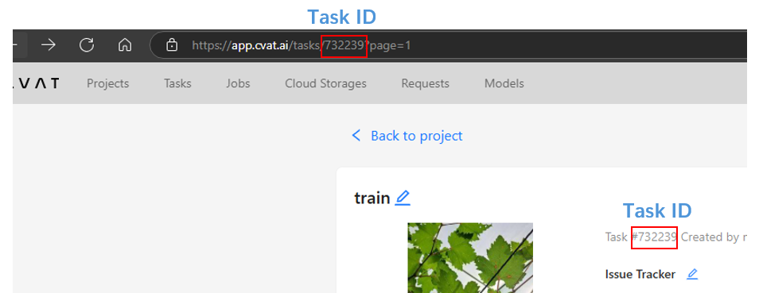
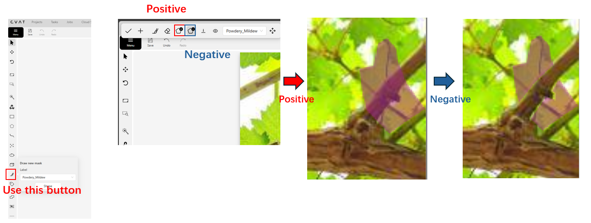
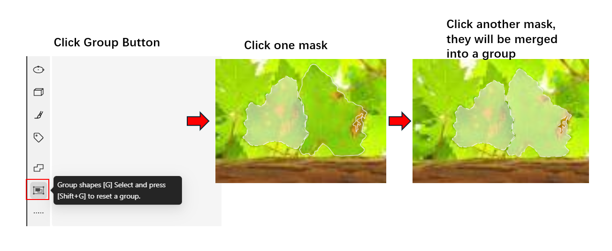

# CVAT


## What is CVAT?

CVAT is an interactive video and image annotation tool for computer vision. It is used by tens of thousands of users and companies around the world. Our mission is to help developers, companies, and organizations around the world to solve real problems using the Data-centric AI approach.

## Installation

### Install docker
If you have installed docker, please skip this step.

```
sudo apt-get update
sudo apt-get --no-install-recommends install -y apt-transport-https ca-certificates curl gnupg-agent software-properties-common
curl -fsSL https://download.docker.com/linux/ubuntu/gpg | sudo apt-key add –
sudo add-apt-repository "deb [arch=amd64] https://download.docker.com/linux/ubuntu  $(lsb_release -cs) stable"
sudo apt-get update
sudo apt-get --no-install-recommends install –y docker-ce docker-ce-cli containerd.io docker-compose-plugin
After docker installation, the current user need to be added to docker group, and logout then login to have enough privilege to use docker.
```

### Install Nuclio
Please refer to [Semi-automatic and Automatic Annotation | CVAT](https://docs.cvat.ai/docs/administration/advanced/installation_automatic_annotation/)

```
wget https://github.com/nuclio/nuclio/releases/download/1.8.14/nuctl-1.8.14-linux-amd64
sudo chmod +x nuctl-1.8.14-linux-amd64
sudo ln -sf $(pwd)/nuctl-1.8.14-linux-amd64 /usr/local/bin/nuctl

```

### Install and run CVAT
Please refer to [Installation Guide | CVAT](https://docs.cvat.ai/docs/administration/basics/installation/) and [Semi-automatic and Automatic Annotation | CVAT](https://docs.cvat.ai/docs/administration/advanced/installation_automatic_annotation/)

```
git clone -b v2.30.0 https://github.com/cvat-ai/cvat.git --depth 1
cd cvat
# run cvat server
docker compose -f docker-compose.yml -f components/serverless/docker-compose.serverless.yml up -d
```

### Stop CVAT
Don’t issue this command if CVAT need to be used.

```
docker compose -f docker-compose.yml -f components/serverless/docker-compose.serverless.yml down
```

### load lsl base serverless image
Restore docker image from tarball

```
docker load <  ${path_to_lsl_cvat_base_serverless.tar}
```

## Launch CVAT
Following operations assume that both Label Studio and ML backend service are running on the same machine, and the Label Studio process has direct HTTP access to ML backend service. That means HTTP proxy should not be used then launching Label Studio. Because HTTP proxy may interfere the access, for example proxy may not handle URLs like http://127.0.0.1 or http://localhost correctly.

### CVAT setup
Assume a LSL project has been create previously.

``` 
    cd ${PATH_TO_PROJECT}

    # Setup CVAT connection info in LSL
    lsl cvat-setup  --url ${cvat_url} \     # e.g. http://localhost:8080
                --cvat-username ${cvat_account_name} \
                --cvat-password ${cvat_account_password} \
                [--cvat-orgname ${cvat_orgnization_short_name}]
```
If `cvat-orgname` has been set up, the LSL pseudo labels and images(target dataset) will be exported to specified orgnization of CVAT when doing lsl cvat export step. If not, the target dataset will be exported to personal workspace.

### Import data from CVAT task

If CVAT already has a label task (project), then it can be imported to LSL by following command.
```
    cd ${PATH_TO_PROJECT} 

    lsl import --cvat-task-id ${cvat_task_id} --name {test_data_source_name}
```


CVAT task ID can be obtained from cvat url, e.g. it is 4 on http://localhost:8080/tasks/4/jobs/9.

⚠️Limitation: If a task is labeled by multiple people, only the latest annotations will be imported.

### Export LSL predictions to CVAT
LSL pseudo label can be exported to CVAT by following command.
```
    cd ${PATH_TO_PROJECT} 

    # Export LSL auto-labeling result to CVAT
    lsl cvat-export  --train ${train_data_source_name} \
                --name ${test_data_source_name} \
                --cvat-name ${cvat_task_name}

```
After that it can be checked on http://localhost:8080/

### CVAT Inference
LSL can pull images from CVAT, add pseudo label and push the annotation back to CVAT.
Assume a CVAT project has been created in advance and images have added to that project.
```
    cd ${PATH_TO_PROJECT} 

    lsl cvat-inference  --train ${train_data_source_name} \
                --cvat-task-id ${cvat_task_id} \
                [--conf ${confidence_score}] \
                [--mask-threshold ${used for fsis and fsis_segonly, threshold to filter the border of mask}] \
                [--slidewindow] <do not set it if you don't want to use slidewindow> \
                [--slidewindow-size ${slidewindow_width, default 1024} ${slidewindow_height, default 1024}] \
                [--overlap ${overlap, default 150}]
```

### CVAT serverless
Please refer to [Serverless tutorial | CVAT](https://docs.cvat.ai/docs/manual/advanced/serverless-tutorial/) for more information and details.

LSL can act as backend to CVAT, then CVAT can call LSL to add pseudo label.
To do so a LSL backend service need to be started as following (only --train argument is mandatory, others are optional)
```
    cd ${PATH_TO_PROJECT} 

    lsl cvat-serverless  --train ${train_data_source_name} \
                --cvat-serverless-image ${cvat_base_serverless_docker_image, default zerorpc_demo:v1} \
                [--conf ${confidence_score}] \
                [--mask-threshold ${used for fsis and fsis_segonly, threshold to filter the border of mask}] \
                [--slidewindow] <do not set it if you don't want to use slidewindow> \
                [--slidewindow-size ${slidewindow_width, default 1024} ${slidewindow_height, default 1024}] \
                [--overlap ${overlap, default 150}]
```
After that a new model will be lost in 'Models' tab on http://localhost:8080/
Then open the CVAT task (project) without annotation, click the 'AI tools' icon on the left menu bar, select the LSL backend model and click the annotate button.
    AI tools -> Detector -> Model -> <your/model/name> 
Finally pseudo labels will be added to the image, and display on the CVAT web UI.

## Tips

### Fail to activate Docker
These issues are mostly caused by proxies, you can try to switch proxies to solve this.

### Positive and Negative RLE
Complex masks can be labeled with combination of positive and negative masks.



### Group Polygons
Multiple masks can be grouped together using the group function.



