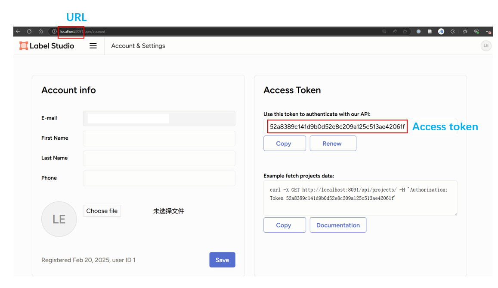
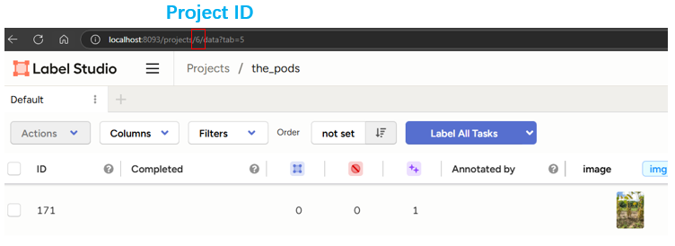
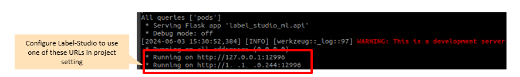

# LabelStudio


## What is Label Studio?

Label Studio is an open source data labeling tool. It lets you label data types like audio, text, images, videos, and time series with a simple and straightforward UI and export to various model formats. It can be used to prepare raw data or improve existing training data to get more accurate ML models.

## Installation

```
pip install label-studio
```

## Launch Label Studio
Following operations assume that both Label Studio and ML backend service are running on the same machine, and the Label Studio process has direct HTTP access to ML backend service. That means HTTP proxy should not be used then launching Label Studio. Because HTTP proxy may interfere the access, for example proxy may not handle URLs like http://127.0.0.1 or http://localhost correctly.

## Label Studio setup
```
    cd ${PATH_TO_PROJECT}

    # Setup Label Studio connection info in LSL
    lsl labelstudio-setup  --url ${labelstudio_url} \
                --token ${labelstudio_access_token}

```



## Import data from LabelStudio

```
    # Import train & validation data from Label Studio project (labelstudio-setup should be done first)
    lsl import --labelstudio-project-id <labelstudio/project/id> \
               --name <data_source_name>
    # labelstudio-project-id can be obtained from labelstudio url
```



## Auto export LSL predictions to Label Studio
```
    cd ${PATH_TO_PROJECT}

    # Export LSL auto-labeling result to Label Studio
    lsl labelstudio-export  --train ${train_data_source_name} \
                --name ${test_data_source_name} \
                --labelstudio-name ${labelstudio_project_name}

```
After labelstudio-export finished successfully, an new Label Studio project with specified name will be created. Users can make annotation on that project in Label Studio directly.

*. Labelstudio only supports single-group polygons instead of multi-group. Therefore for `fsis_segonly` task, the pseudo labels on LabelStudio may be incomplete. Labelstudio functions(`Export` and `ML Backend`) would be better to be used in special cases(when a image has only one complete mask) for `fsis_segonly` task.

## Label Studio ML
Trained LSL model can serve as a ML backend to Label Studio. Following labelstudio-ml-start command starts a ML backend service. 


```
    cd ${PATH_TO_PROJECT}

    # Start ML backend service
    lsl labelstudio-ml-start  --train <train_data_source_name> \
                --labelstudio-ml-port <labelstudio/ml/port> \
                [--conf <confidence/score>] \
                [--slidewindow] <use slidewindow or not>\
                [--slidewindow-size <slidewindow/width, default 1024> <slidewindow/height, default 1024>]
                [--overlap <overlap, default 150>]
```
The labelstudio-ml-start command will print an HTTP URL and blocked (not returned to shell).



 User need to setup Label Studio to use the HTTP URL in Label Studio project setting page. If the service is not used anymore, user can issue an Ctrl-C in the terminal to quit the backend service.

*. The <labelstudio-ml-port> port number is optional, the default TCP port will be used if not specified on command line.